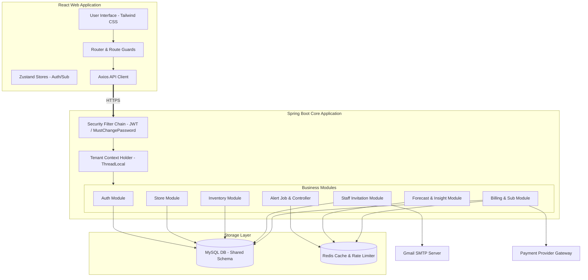
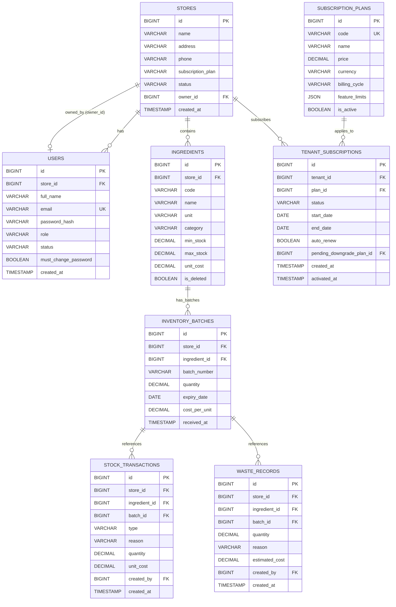

# TÀI LIỆU THIẾT KẾ KỸ THUẬT (TECHNICAL DESIGN DOCUMENT)
## DỰ ÁN: AI Inventory & Waste Manager
### Vai trò: Technical Lead

---

## 1. Tổng quan Kiến trúc Hệ thống (System Architecture Overview)

### 1.1 Lựa chọn Kiến trúc
Hệ thống **AI Inventory & Waste Manager** được triển khai theo mô hình kiến trúc **Modular Monolith (Monolith mô-đun hóa)** ở Backend và **Single Page Application (SPA)** ở Frontend.
*   **Modular Monolith**: Thay vì chia nhỏ thành các microservices ngay từ đầu gây phức tạp về mặt vận hành, toàn bộ dự án Spring Boot được phân chia thành các package độc lập theo nghiệp vụ (Domain-driven packages). Mỗi mô-đun quản lý các thực thể (Entities), giao diện lập trình (Controllers) và logic nghiệp vụ (Services) riêng. Việc giao tiếp giữa các mô-đun được thực hiện trực tiếp thông qua Java Dependency Injection (DI) hoặc gián tiếp qua cơ sở dữ liệu.
*   **Frontend SPA**: Phát triển bằng React 19, Vite và TypeScript, giao tiếp với Backend thông qua các RESTful API bảo mật bằng JWT.

### 1.2 Sơ đồ thành phần (Component Diagram)



---

## 2. Thiết kế Đa người thuê (Multi-tenancy Design)

### 2.1 Chiến lược phân tách dữ liệu (Data Isolation Strategy)
Dự án sử dụng chiến lược **Shared Schema with Tenant Column (Dùng chung Schema phân tách bằng cột)**.
*   Bảng gốc biểu thị Tenant là `stores`.
*   Tất cả các bảng lưu dữ liệu nghiệp vụ quan trọng (`users`, `ingredients`, `inventory_batches`, `stock_transactions`, `waste_records`, `alerts`, `tenant_subscriptions`) đều có cột khóa ngoại `store_id` (nối với `stores(id)`).
*   *Lý do lựa chọn*: Tiết kiệm chi phí tài nguyên phần cứng tối đa, đơn giản hóa việc bảo trì cấu trúc cơ sở dữ liệu (Flyway migration chỉ cần chạy 1 lần cho toàn bộ hệ thống) và phù hợp với mô hình SaaS dành cho các cửa hàng F&B quy mô nhỏ đến vừa.

### 2.2 Luồng giải mã Tenant Context (Tenant Resolution Flow)
Luồng giải mã và cô lập dữ liệu diễn ra như sau:
1.  **Request Client**: Trình duyệt gửi request HTTP kèm tiêu đề `x-store-id` (chứa ID của cửa hàng đang chọn) và header `Authorization: Bearer <JWT_Token>`.
2.  **Bộ lọc JWT Filter**: `JwtAuthenticationFilter` chặn request và thực hiện:
    *   Trích xuất và giải mã JWT token thông qua `JwtUtil` thu về đối tượng `UserPrincipal`.
    *   Xác định ID store cần truy cập: Nếu có header `x-store-id`, hệ thống kiểm tra xem User có quyền truy cập store đó hay không (User có `Role.SYSTEM_ADMIN` hoặc ID store trùng với `principal.storeId()` hoặc User là chủ sở hữu store đó). Nếu không có header, mặc định lấy `storeId` từ chính payload của JWT.
    *   Thiết lập context: Gán ID store đã được phê duyệt vào `TenantContext` bằng câu lệnh `TenantContext.setStoreId(selectedStoreId)`.
3.  **Tầng Repository**: Khi các Service gọi câu lệnh SQL, `storeId` được lấy từ `TenantContext` thông qua `SecurityUtils.storeId()` để làm tham số lọc dữ liệu.
4.  **Dọn dẹp Context**: Trong khối lệnh `finally` của filter, hệ thống gọi `TenantContext.clear()` để tránh tình trạng rò rỉ dữ liệu giữa các luồng xử lý của Tomcat (Thread Local Leakage).

---

## 3. Xác thực & Phân quyền (Authentication & Authorization)

### 3.1 Luồng JWT (Stateless Token Flow)
Hệ thống sử dụng cơ chế JWT bảo mật không lưu trạng thái (Stateless):
*   **Đăng nhập**: Khi gọi POST `/api/auth/login` thành công, máy chủ cấp phát 2 token:
    *   `accessToken`: Thời gian sống 30 phút, dùng để truy cập các tài nguyên.
    *   `refreshToken`: Thời gian sống 14 ngày, lưu trên Client và một bản copy được lưu trong Redis.
*   **Tải trọng JWT (Payload Claim)**:
    ```json
    {
      "sub": "owner@coffee.vn",
      "userId": 2,
      "storeId": 1,
      "role": "OWNER",
      "mustChangePassword": false,
      "iat": 1783935300,
      "exp": 1783937100
    }
    ```

### 3.2 Cấu trúc 4 cấp vai trò & Triển khai RBAC
Phân quyền truy cập dựa trên vai trò (RBAC) được cấu hình tại tầng phương thức bằng Spring Security Method Security (`@EnableMethodSecurity`).
*   **Danh sách vai trò**: `SYSTEM_ADMIN`, `OWNER`, `MANAGER`, `STAFF`.
*   **Bộ lọc ép buộc đổi mật khẩu (`MustChangePasswordFilter`)**:
    *   Đứng sau `JwtAuthenticationFilter`.
    *   Nếu cờ `mustChangePassword` trong JWT giải mã là `true` và endpoint gọi đến bắt đầu bằng `/api/` (trừ các API đăng nhập/đổi mật khẩu), bộ lọc sẽ lập tức ngắt chuỗi filter và trả về JSON lỗi `MUST_CHANGE_PASSWORD` kèm HTTP Status `403 Forbidden`.

```java
// Ví dụ cấu hình phân quyền trên Controller
@RestController
@RequestMapping("/api/reports")
@PreAuthorize("hasAnyRole('OWNER','MANAGER')")
public class ReportController { ... }
```

---

## 4. Thiết kế Cơ sở dữ liệu (Database Design)

### 4.1 Sơ đồ thực thể liên kết (ERD)



### 4.2 Chiến lược thiết lập Index (Indexing Strategy)
Để tối ưu hiệu năng truy vấn đa người thuê (Multi-tenant) khi dữ liệu lớn lên, các chỉ mục sau được định nghĩa trong Flyway Migrations:
*   `idx_users_store_role` trên bảng `users(store_id, role)`: Tối ưu hóa việc đếm và tải danh sách nhân sự của từng store.
*   `idx_ingredients_store_deleted` trên bảng `ingredients(store_id, is_deleted)`: Tối ưu hóa việc hiển thị danh mục nguyên liệu chưa bị xóa mềm của cửa hàng.
*   `idx_batches_store_ingredient_expiry` trên bảng `inventory_batches(store_id, ingredient_id, expiry_date)`: Hỗ trợ đắc lực thuật toán FEFO khi tìm kiếm các lô hàng sắp hết hạn trước để trừ tồn kho.
*   `idx_tx_store_ingredient_type_created` trên bảng `stock_transactions(store_id, ingredient_id, type, created_at)`: Tăng tốc độ tính toán báo cáo tiêu hao và lịch sử kho.
*   `idx_tenant_subscriptions_tenant_status` trên bảng `tenant_subscriptions(tenant_id, status)`: Kiểm tra nhanh hạn mức gói cước đang kích hoạt của tenant.

---

## 5. Triển khai các Mô-đun Cốt lõi (Core Modules Implementation)

### 5.1 Xử lý xuất kho tối ưu FEFO & Lock tránh Race Condition
Khi có giao dịch xuất kho nguyên liệu, hệ thống cần ngăn chặn hiện tượng trừ kho âm hoặc lệch tồn do nhiều luồng xử lý đồng thời (Race Condition).
*   **Cơ chế Lock**: Sử dụng **Pessimistic Write Lock (Khóa bi quan)** bằng Annotation JPA `@Lock(LockModeType.PESSIMISTIC_WRITE)` khi tải các lô hàng hoạt động. Câu lệnh SQL sinh ra sẽ chứa mệnh đề `SELECT ... FOR UPDATE`.
*   **Logic FEFO tại Service Layer**:
    ```java
    // 1. Tải danh sách lô hàng chưa hết hạn, còn hàng của nguyên liệu được chọn (áp dụng Pessimistic Lock)
    List<InventoryBatch> batches = batchRepository
        .findActiveBatchesForUpdate(storeId, ingredientId, LocalDate.now());
    
    // 2. Sắp xếp danh sách lô hàng: Hạn sử dụng tăng dần (FEFO), ngày nhận tăng dần
    batches.sort(Comparator.comparing(InventoryBatch::getExpiryDate)
                           .thenComparing(InventoryBatch::getReceivedAt));

    // 3. Trừ dần lượng xuất từ các lô
    BigDecimal remainingToDeduct = amountToDeduct;
    for (InventoryBatch batch : batches) {
        if (remainingToDeduct.compareTo(BigDecimal.ZERO) <= 0) break;
        
        BigDecimal availableQty = batch.getQuantity();
        BigDecimal deductedFromThisBatch = availableQty.min(remainingToDeduct);
        
        // Cập nhật số lượng của lô
        batch.setQuantity(availableQty.subtract(deductedFromThisBatch));
        batchRepository.save(batch);
        
        // Ghi nhận transaction
        createStockTransaction(batch, deductedFromThisBatch, StockTransactionType.OUT);
        
        remainingToDeduct = remainingToDeduct.subtract(deductedFromThisBatch);
    }
    ```

### 5.2 Kiểm soát Subscription & Entitlements
*   **Entitlements Verification**: Trước khi thực thi các tác vụ ghi dữ liệu mới, hệ thống gọi `PlanEntitlementService` để lấy thông tin giới hạn tài nguyên của gói hiện tại (đọc từ cache Redis trước, nếu trống sẽ truy vấn DB).
*   **Trường hợp vượt ngưỡng**: Nếu số lượng nhân viên hoặc nguyên liệu hiện tại vượt giới hạn, hệ thống ném ra `AppException(ErrorCode.PLAN_LIMIT_EXCEEDED)` ngăn không cho lưu vào DB.

### 5.3 Luồng Mời Nhân viên & Rate Limiting
*   **Sinh Token an toàn**: Sử dụng `SecureRandom` sinh chuỗi hexa 32 ký tự ngẫu nhiên làm Token mời. Token thô gửi qua email cho nhân sự, phiên bản băm SHA-256 được lưu trữ trong bảng `invite_tokens` để chống rò rỉ token từ DB.
*   **Rate Limiter**: Trước khi thực hiện gửi email mời, hệ thống gọi `StaffInviteRateLimiter` kiểm tra khóa Redis `staff_invite:<inviter_id>:<store_id>`. 
    *   Mỗi khi có yêu cầu, thực hiện lệnh `redisTemplate.opsForValue().increment(key)`. Nếu giá trị bằng 1, thiết lập TTL là 60 phút.
    *   Nếu giá trị vượt quá 5, ném lỗi `Too Many Requests`. Nếu kết nối Redis bị gián đoạn, hệ thống tự động chuyển sang bộ đếm nội bộ sử dụng `ConcurrentHashMap` lưu trong bộ nhớ máy chủ.

### 5.4 Cấu hình Caching Redis
Redis được tích hợp nhằm giảm tải cho MySQL và tăng tốc độ xử lý:
*   **Cache Refresh Token**: Lưu danh sách `refreshToken` hợp lệ để quản lý phiên đăng nhập và thu hồi token tức thì khi người dùng đăng xuất hoặc đổi mật khẩu.
*   **Cache Entitlements**: Lưu giới hạn tính năng của từng store theo cấu trúc key: `store_entitlements:<store_id>`. Cache bị vô hiệu hóa (evicted) khi store có giao dịch nâng cấp gói thành công.

---

## 6. Thiết kế API (API Design)

Tất cả các API giao tiếp đều sử dụng tiền tố `/api` và định dạng trả về chuẩn.

| Module | Method | Path | Request Body | Response DTO mẫu (data) |
| :--- | :--- | :--- | :--- | :--- |
| **Auth** | POST | `/api/auth/login` | `{ "email": "...", "password": "..." }` | `{ "accessToken": "...", "refreshToken": "..." }` |
| **Auth** | POST | `/api/auth/first-login-change-password` | `{ "newPassword": "..." }` | `{ "status": "ACTIVATED" }` |
| **Staff** | POST | `/api/stores/{storeId}/staff/invitations` | `{ "email": "staff@a.com", "role": "STAFF" }` | `{ "id": 12, "email": "staff@a.com", "status": "PENDING" }` |
| **Inventory**| POST | `/api/inventory/in` | `{ "ingredientId": 1, "quantity": 10.0, "expiryDate": "2026-12-01", "costPerUnit": 50000 }` | `{ "transactionId": 45, "status": "SUCCESS" }` |
| **Inventory**| POST | `/api/inventory/out` | `{ "ingredientId": 1, "quantity": 3.5, "reason": "EXPORT_CONSUME" }` | `{ "deductedBatches": [{ "batchId": 3, "qty": 3.5 }] }` |
| **Alert** | GET | `/api/alerts` | None | `[{ "id": 1, "type": "LOW_STOCK", "message": "..." }]` |
| **Forecast** | GET | `/api/forecast` | (Query params: `ingredientId`, `days`) | `{ "ingredientId": 1, "recommendedOrder": 15.0 }` |
| **Billing** | POST | `/api/subscriptions/upgrade` | `{ "planCode": "PRO" }` | `{ "transactionId": 89, "paymentUrl": "http://checkout.vn/..." }` |

---

## 7. Các vấn đề Bảo mật (Security Considerations)

*   **Quản lý Secret Key**: JWT Secret Key tuyệt đối không lưu cứng trong code. Hệ thống đọc từ biến môi trường thông qua thuộc tính `app.jwt.secret`. Trong môi trường Dev, nếu biến này trống, hệ thống sử dụng chuỗi dự phòng tạm thời nhưng sẽ đưa ra cảnh báo ở log.
*   **Băm mật khẩu**: Toàn bộ mật khẩu của người dùng được băm một chiều bằng **BCryptPasswordEncoder** với độ phức tạp mặc định (strength = 10) trước khi ghi vào cơ sở dữ liệu.
*   **CORS Configuration**: Cấu hình lọc CORS chặt chẽ, chỉ chấp nhận các nguồn gốc (origins) tin cậy được chỉ định sẵn trong `application.yml` (ví dụ: `http://localhost:5173`).
*   **SQL Injection**: 100% các câu truy vấn cơ sở dữ liệu đều được thực hiện thông qua Spring Data JPA Specification hoặc Named Parameters trong Native Query, ngăn chặn hoàn toàn tấn công SQL Injection.

---

## 8. Kiến trúc triển khai (Deployment Architecture)

### 8.1 Triển khai Container hóa với Docker
Hệ thống được đóng gói thành các container Docker giúp nhất quán môi trường triển khai.

#### File cấu hình `Dockerfile` cho Backend:
```dockerfile
# Sử dụng JDK 21 chính thức phiên bản nhẹ
FROM eclipse-temurin:21-jre-alpine
WORKDIR /app
COPY build/libs/inventory-backend-0.0.1-SNAPSHOT.jar app.jar
EXPOSE 8080
ENTRYPOINT ["java", "-jar", "app.jar"]
```

#### File cấu hình chạy đa hạ tầng `docker-compose.yml`:
```yaml
version: '3.8'
services:
  backend-api:
    build: .
    ports:
      - "8080:8080"
    environment:
      - SPRING_DATASOURCE_URL=jdbc:mysql://mysql-db:3306/inventory_ai?useSSL=false
      - SPRING_DATASOURCE_USERNAME=root
      - SPRING_DATASOURCE_PASSWORD=secret_db_pass
      - SPRING_DATA_REDIS_HOST=redis-cache
    depends_on:
      - mysql-db
      - redis-cache

  mysql-db:
    image: mysql:8.0
    ports:
      - "3306:3306"
    environment:
      - MYSQL_DATABASE=inventory_ai
      - MYSQL_ROOT_PASSWORD=secret_db_pass
    volumes:
      - mysql-data:/var/lib/mysql

  redis-cache:
    image: redis:6-alpine
    ports:
      - "6379:6379"

volumes:
  mysql-data:
```

---

## 9. Chiến lược Kiểm thử (Testing Strategy)

Hệ thống phân chia chiến lược kiểm thử thành 2 mức độ chính:

### 9.1 Kiểm thử đơn vị (Unit Test)
*   **Phạm vi**: Tập trung kiểm thử logic thuật toán tại Service Layer, đặc biệt là FEFO xuất kho và công thức dự báo.
*   **Công cụ**: JUnit 5, Mockito để mock các tầng Repositories.
*   *Mục tiêu*: Đảm bảo các hàm tính toán xử lý chính xác số lượng tồn và phân bổ lô hàng khi có dữ liệu đầu vào giả định.

### 9.2 Kiểm thử tích hợp (Integration Test)
*   **Phạm vi**: Kiểm thử toàn bộ luồng gọi API từ Controller qua bộ lọc Security Filter Chain đến DB.
*   **Công cụ**: `@SpringBootTest` kết hợp `@AutoConfigureMockMvc` và thư viện `spring-security-test`.
*   *Mục tiêu*: Xác minh các bộ lọc bảo mật (`JwtAuthenticationFilter`, `MustChangePasswordFilter`) chặn và cho phép truy cập chính xác theo vai trò người dùng thực tế.

---

## 10. Các giới hạn đã biết & Nợ kỹ thuật (Known Limitations & Tech Debt)

1.  **Sự không khớp tên vai trò giữa FE và BE**:
    *   *Chi tiết*: Frontend dùng định nghĩa type `'STORE_OWNER'`, trong khi database và JWT payload của backend trả về giá trị `'OWNER'`.
    *   *Biện pháp giải quyết*: Cần chỉnh sửa file định nghĩa type của Frontend tại [src/types/index.ts](file:///Users/hoangluong/Documents/AI%20Inventory%20&%20Waste%20Manager/src/types/index.ts) để đồng bộ hóa hoàn toàn về giá trị `'OWNER'`.
2.  **Logic nghiệp vụ nằm tại Controller (Fat Controllers)**:
    *   *Chi tiết*: `ReportController` và `AlertController` trực tiếp thực thi truy vấn dữ liệu và tính toán cấu trúc báo cáo mà không thông qua lớp Service trung gian.
    *   *Biện pháp giải quyết*: Cần refactor tách toàn bộ mã xử lý nghiệp vụ báo cáo sang các class mới như `ReportService` và `AlertService` để đảm bảo kiến trúc sạch và dễ viết Unit Test.
3.  **Tỷ lệ bao phủ kiểm thử thấp (Low Test Coverage)**:
    *   *Chi tiết*: Hiện tại hệ thống mới chỉ có test cho module `insight` và `staff`. Hầu hết các luồng giao dịch kho cốt lõi đều chưa được bảo vệ bằng kiểm thử tự động.
    *   *Biện pháp giải quyết*: Lên kế hoạch bổ sung tối thiểu 30 ca kiểm thử cho `InventoryService` và `SubscriptionService`.
